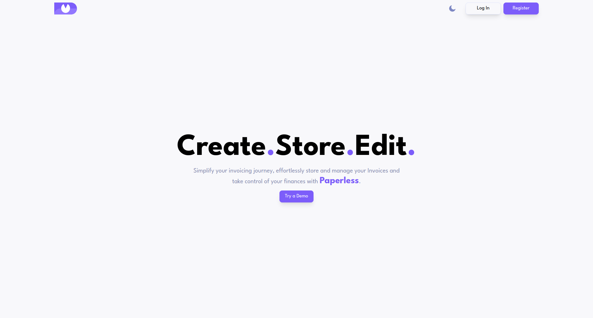

# invoice-app

*** NOTE THAT BEACUSE THE API IS HOSTED ON THE FREE TIER OF RENDER.COM, THE FIRST TIME ACCESS OF THE APP WILL REQUIRE AROUND 3 MINUTES FOR THE SERVER TO BE BUILT.

## Table of contents

- [Overview](#overview)
  - [Screenshot](#screenshot)
  - [Features](#features)
  - [Links](#links)
- [My process](#my-process)
  - [Built with](#built-with)
  - [Implementation](#implementation)
  - [Known issues](#known-issues)
  - [Useful resources](#useful-resources)
- [Author](#author)

## Overview

### Screenshot

### Links

- [Live Site Demo](https://invoice-app-mariushor.netlify.app)
- [Code Repository](https://github.com/MariusHor/invoice-app)

### Features

- Simple landing page
- Demo version
- Authentication
- User Profile customization
- User invoices CRUD operations
- Light / Dark theme
- * Admin page (in development)

## My process

### Built with

- TypeScript
- React
- React Query
- React Router
- Vite
- Material UI
- Tailwind
- Framer Motion
- Yup
- Formik
- Axios
- ExpressJs
- MongoDb
- Mongoose
- Cloudinary
- Netlify and Render for deployment

### Implementation

My intentions with this project were for it to be my first real **React** portfolio project as I have already practiced building some smaller ones locally. While getting more and more confident with React, I thought that it was also the right time to begin learning **TypeScript**. After working with it during the development of this project, I can say that I would probably not want to go back to writing my applications in pure JavaScript because TypeScript can really make my life as a developer easier. Adding static types to my code means that not only the readability is improved but it also allows for errors to be caught earlier in the development process.

I've decided to use the **React Query** library as an async state manager instead of handling async api calls through React's useEffect hook. This has brought numerous benefits, such as giving me the ability to cache api results and have an overall better control on how and when would the app refresh the async data. 

For handling the app's forms I have used **Formik** while for form validations I have use Yup. While I do know that Formik is no longer being maintained, I wanted to give it a try to better understand why the React community has shifted towards the *React Hook Form* library. I did like the flow of using Formik but as I've had a better experience locally with React Hook Form I can say that the latter will be my go to library for handling React forms in the future. 

I would also like to mention that while using **React Router v6**, I really wanted to implement the use of their latest features such as using Route *loaders* and *actions* but unfortunately, using it with Formik and React Query, I could not find a simple enough and effective solution to send the form data from Formik to the actions handlers of *React Router*. This would have brought an important benefit to the app as these features would have made so that the Routes would have had pre loaded data before being accesed so I would not have use spinners anymore. I will however start to use these features in the future while using *React Hook Form* instead of Formik.

For the **Express API** that I have created, I have tried to focus on building the *CRUD operations* of the app, involving both the user unique invoices and the user profile settings. I had to first build an Authentication system which has allowed me to dive deeper into some security aspects and learning about JWT tokens. While this is not a production solution, it provides the ability to register a new account and login with the newly created credentials while also givin the user the ability to persist the login through a page refresh. The JWT tokens have been implemented in a way such as if the access token expires, the API gets queried for a new one and if the request header contains the refresh token and if its still valid, the user will receive a new access token, allowing him to stay logged in and continue with the app navigation. On log out, the refresh token gets effectively removed from the browser cookies to prevent accessing the app dashboard without a valid login.

Overall, this has been the most complex project that I have worked on and I've really enjoyed it. It allowed be to get a better grasp of React and its eco system and made me even more eager to jump into future projects. Not only that but it being a Fullstack application, my backend capabilities have improved as well. Now I can build an Express API with more confidence than before while clearly understanding what and why I am doing certain things.

### Further project development

I would like to further develop this project by implementing an admin dashboard that allows the admin to see all the active users and give the ability to remove or edit user profiles as well as their invoice content. Admin should also be able to search either for usernames or specific invoice keywords. Another nice thing to implement would be to display a couple of helpful timeline reports.

### Useful resources

- [TypeScript documentation](https://www.typescriptlang.org)
- [React documentation](https://react.dev)
- [React Query documentation](https://tanstack.com/query/v3/)
- [React Router documentation](https://reactrouter.com/en/main)
- [Formik documentation](https://formik.org/docs/overview)
- [Yup documentation](https://github.com/jquense/yup)
- [Tailwind documentation](https://tailwindcss.com/docs/installation)
- [ExpressJs documentation](https://expressjs.com)
- [Mongoose documentation](https://mongoosejs.com)

## Author

- Github - [@MariusHor](https://github.com/MariusHor/)
- Frontend Mentor - [@MariusHor](https://www.frontendmentor.io/profile/MariusHor)
